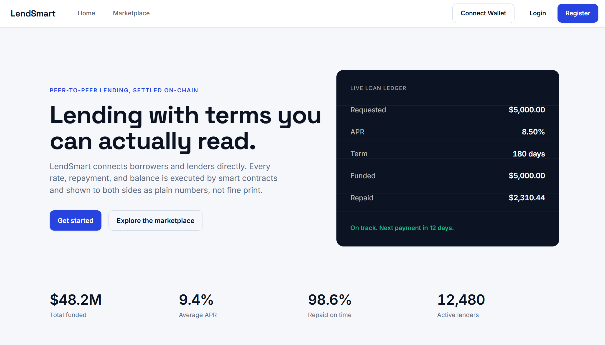

# LendSmart


## AI-Powered Decentralized Lending Platform

LendSmart is a decentralized lending platform: a Node.js/Express backend for auth, users, loans, and admin, paired with a React web dashboard and a React Native mobile app with real wallet connectivity (ethers.js and WalletConnect on both clients). Loan risk is assessed two ways: a rule-based JavaScript scoring service running in the backend itself, and a genuine Python ML service (LightGBM, XGBoost, and a scikit-learn ensemble, with SHAP for explainability) that the backend calls over HTTP.

<div align="center">
  
</div>

## Table of Contents

- [Overview](#overview)
- [Project Structure](#project-structure)
- [Feature Status](#feature-status)
- [Technology Stack](#technology-stack)
- [Architecture](#architecture)
- [Installation and Setup](#installation-and-setup)
- [Running the Stack](#running-the-stack)
- [API Surface](#api-surface)
- [Testing](#testing)
- [CI/CD Pipeline](#cicd-pipeline)
- [Documentation](#documentation)
- [Contributing](#contributing)
- [License](#license)

## Overview

LendSmart demonstrates a decentralized lending workflow across a real, runnable codebase. The Express backend, Hardhat smart contracts, and both clients are wired and covered by tests. Credit scoring has two independent, genuinely wired paths: `creditScoringService.js` computes a rule-based score in-process from payment history, while `aiService.js` calls a separate Flask service backed by a real, substantial ML model. Both are real; they're just two different scoring mechanisms living side by side rather than one unified pipeline.

## Project Structure

```
LendSmart/
├── code/
│   ├── backend/                  # Express application
│   │   ├── src/routes/           # auth, users, loans, admin
│   │   ├── src/controllers/      # Request handlers for each route group
│   │   ├── src/services/         # creditScoringService (rule-based), ai/aiService
│   │   │                         # (calls the Flask ML service), blockchain service
│   │   ├── src/compliance/       # auditLogger, gdprCompliance (both genuinely wired
│   │   │                         # into controllers and services)
│   │   ├── src/security/         # authService
│   │   ├── src/middleware/       # rate limiting, error handling, monitoring
│   │   └── tests/                # unit, integration, and security test suites
│   ├── blockchain/               # Hardhat project (the active toolchain)
│   │   ├── contracts/            # LendSmartLoan, LoanContract, LoanRegistry, MockERC20
│   │   ├── truffle/              # A separate, unused Truffle project; no script
│   │   │                         # in this repo references it
│   │   └── test/                 # Hardhat test suite
│   └── ml_services/
│       ├── credit_risk/          # LightGBM/XGBoost/sklearn ensemble with SHAP,
│       │                         # served by prediction_service.py (Flask)
│       ├── compliance/           # Audit log storage
│       └── integration/          # Integration helpers
├── web-frontend/                 # React (Create React App) dashboard
├── mobile-frontend/              # React Native app (bare RN plus Expo tooling,
│                                 # with a Gemfile for native iOS builds)
├── infrastructure/               # Docker, Kubernetes, Terraform, Ansible, monitoring
├── scripts/                      # Setup, run, test, lint, and deployment scripts
├── docs/                         # Documentation (this directory)
└── README.md
```

## Feature Status

### Application tier (wired and tested)

| Component                     | Details                                                                                                                                                                                                                           |
| :---------------------------- | :-------------------------------------------------------------------------------------------------------------------------------------------------------------------------------------------------------------------------------- |
| **API**                       | Express backend exposing `/api/auth`, `/api/users`, `/api/loans`, and `/api/admin`.                                                                                                                                               |
| **Auth**                      | JWT access and refresh tokens, password update, and MFA setup and verification endpoints.                                                                                                                                         |
| **Rule-based credit scoring** | `creditScoringService.js` computes a score in-process from on-time payment ratio, default ratio, and late-payment count.                                                                                                          |
| **ML-based risk scoring**     | `aiService.js` calls a separate Flask service (`/predict/risk`) backed by a real LightGBM, XGBoost, and scikit-learn ensemble model, with SHAP for explainability.                                                                |
| **Compliance**                | `auditLogger.js` and `gdprCompliance.js` are genuinely imported and used across the loan, admin, and auth controllers, the credit scoring and file upload services, and input validation, not just present as standalone files.   |
| **Smart contracts**           | Hardhat-managed Solidity contracts: `LendSmartLoan`, `LoanContract`, `LoanRegistry`, and a `MockERC20` test token.                                                                                                                |
| **Web dashboard**             | React app (plain JavaScript, Create React App) with Material-UI, Tailwind CSS, ethers.js, and Web3Modal for wallet connections. There is no charting or data-visualization library in this project.                               |
| **Mobile app**                | React Native app (a mix of TypeScript and JavaScript) with React Context for auth, wallet, loan, and theme state, ethers.js, and WalletConnect (`@walletconnect/modal-react-native`) for a genuine mobile wallet connection flow. |

## Technology Stack

| Area            | Technology                                                                                                                            |
| :-------------- | :------------------------------------------------------------------------------------------------------------------------------------ |
| Blockchain      | Solidity, Hardhat                                                                                                                     |
| Backend API     | Node.js, Express, JavaScript                                                                                                          |
| Data layer      | MongoDB (Mongoose), Redis                                                                                                             |
| ML service      | Python, Flask, LightGBM, XGBoost, scikit-learn, SHAP                                                                                  |
| Web frontend    | React 18, JavaScript, Create React App, Material-UI, Emotion, Tailwind CSS, ethers.js, Web3Modal                                      |
| Mobile frontend | React Native, Expo tooling, TypeScript and JavaScript, React Navigation, React Native Paper, ethers.js, WalletConnect, Formik and Yup |
| Infrastructure  | Docker, Docker Compose, Kubernetes, Terraform, Ansible                                                                                |
| Monitoring      | Prometheus, Grafana                                                                                                                   |
| CI/CD           | GitHub Actions                                                                                                                        |
| Testing         | Jest (backend, web, and mobile), Hardhat (contracts), pytest (the ML service)                                                         |

## Architecture

```
Clients
  ├── web-frontend (React)               ── HTTP/JSON ──┐
  └── mobile-frontend (React Native)     ── HTTP/JSON ──┤
                                                        ▼
Backend (Express, /api)
  ├── Routes    auth, users, loans, admin
  ├── Services   creditScoringService (rule-based), aiService (calls the ML service),
  │              blockchain service
  ├── Compliance  auditLogger, gdprCompliance
  └── Data layer   MongoDB (Mongoose), Redis

ML service (code/ml_services/credit_risk, Flask, called over HTTP by aiService.js)
  LightGBM / XGBoost / scikit-learn ensemble, SHAP for explainability

Blockchain (Hardhat / Solidity)
  LendSmartLoan · LoanContract · LoanRegistry · MockERC20
```

See [docs/ARCHITECTURE.md](docs/ARCHITECTURE.md) for detail.

## Installation and Setup

Prerequisites: Node.js 20+, Python 3.11+, and Docker.

```bash
git clone https://github.com/quantsingularity/LendSmart.git
cd LendSmart

# Blockchain
cd code/blockchain
npm install

# Backend
cd ../backend
npm install

# ML service
cd ../ml_services/credit_risk
pip install -r requirements.txt

# Web frontend
cd ../../../web-frontend
npm install

# Mobile frontend
cd ../mobile-frontend
npm install
```

For an automated setup:

```bash
git clone https://github.com/quantsingularity/LendSmart.git
cd LendSmart
./scripts/setup_lendsmart_env.sh
./scripts/run_lendsmart.sh
```

Full, environment-specific instructions are in [docs/INSTALLATION.md](docs/INSTALLATION.md).

## Running the Stack

```bash
# 1) Supporting services (from infrastructure/, Docker required)
docker compose -f docker-compose.yml up -d database redis

# 2) Local chain (from code/blockchain)
npx hardhat node                   # local chain at http://127.0.0.1:8545

# 3) ML service (from code/ml_services/credit_risk)
python prediction_service.py       # serves http://localhost:8001

# 4) Backend (from code/backend)
npm start                          # serves http://localhost:3000 by default;
                                    # override PORT if you're also running the
                                    # web dashboard, since its dev server defaults
                                    # to the same port

# 5) Web dashboard (from web-frontend)
npm start                          # http://localhost:3000 by default (CRA)

# 6) Mobile app (from mobile-frontend)
npm start
```

See [docs/USAGE.md](docs/USAGE.md) and [docs/CONFIGURATION.md](docs/CONFIGURATION.md).

## API Surface

Base URL `http://localhost:3000/api`.

| Group | Prefix       | Highlights                                                                                                   |
| :---- | :----------- | :----------------------------------------------------------------------------------------------------------- |
| Auth  | `/api/auth`  | `register`, `login`, `logout`, `refresh`, `me`, `updatedetails`, `updatepassword`, `setup-mfa`, `verify-mfa` |
| Users | `/api/users` | `role/{role}`, `wallet/{address}`                                                                            |
| Loans | `/api/loans` | list/create, `{id}`, `{id}/fund`                                                                             |
| Admin | `/api/admin` | `users`, `users/{id}/status`, `loans`, `loans/{id}/status`, `analytics`, `metrics`, `audit-logs/export`      |

Full request and response shapes are in [docs/API.md](docs/API.md).

## Testing

```bash
# Backend (from code/backend)
npm test

# Smart contracts (from code/blockchain)
npx hardhat test

# ML service (from code/ml_services/credit_risk)
pytest

# Web (from web-frontend)
npm test

# Mobile (from mobile-frontend)
npm test

# Everything, via the project script
./scripts/run_all_tests.sh
```

The backend suite has 5 test files across unit, integration, and security categories. The Hardhat suite has 4 files. The ML service has its own test file. The web dashboard has 10 test files; the mobile app has 11.

## CI/CD Pipeline

GitHub Actions (`.github/workflows/cicd.yml`) runs four jobs on push, pull request, and manual dispatch:

| Job                           | Depends on          | What it does                                                                         |
| :---------------------------- | :------------------ | :----------------------------------------------------------------------------------- |
| Code Quality Checks           | -                   | Formatter checks across the repository                                               |
| Backend Tests                 | Code Quality Checks | Runs the Jest suite with coverage (Node.js 20) and uploads the report as an artifact |
| Smart Contract Compile & Test | Code Quality Checks | Compiles the contracts with Hardhat and runs the contract test suite                 |
| Web Build                     | Code Quality Checks | Installs dependencies and produces the production web build (no test step)           |

There is currently no CI job for the ML service or the mobile app.

## Documentation

| Document                                           | Contents                               |
| :------------------------------------------------- | :------------------------------------- |
| [docs/README.md](docs/README.md)                   | Documentation index                    |
| [docs/ARCHITECTURE.md](docs/ARCHITECTURE.md)       | System architecture                    |
| [docs/API.md](docs/API.md)                         | REST API reference                     |
| [docs/INSTALLATION.md](docs/INSTALLATION.md)       | Setup for all components               |
| [docs/CONFIGURATION.md](docs/CONFIGURATION.md)     | Environment variables and config       |
| [docs/USAGE.md](docs/USAGE.md)                     | Running and using the platform         |
| [docs/CLI.md](docs/CLI.md)                         | Helper scripts reference               |
| [docs/FEATURE_MATRIX.md](docs/FEATURE_MATRIX.md)   | Feature status, implemented vs planned |
| [docs/TROUBLESHOOTING.md](docs/TROUBLESHOOTING.md) | Common issues and fixes                |
| [docs/CONTRIBUTING.md](docs/CONTRIBUTING.md)       | Contribution guide                     |
| [docs/examples/](docs/examples/)                   | Worked examples                        |

## Contributing

See [docs/CONTRIBUTING.md](docs/CONTRIBUTING.md).

## License

This project is licensed under the MIT License - see the [LICENSE](LICENSE) file for details.
